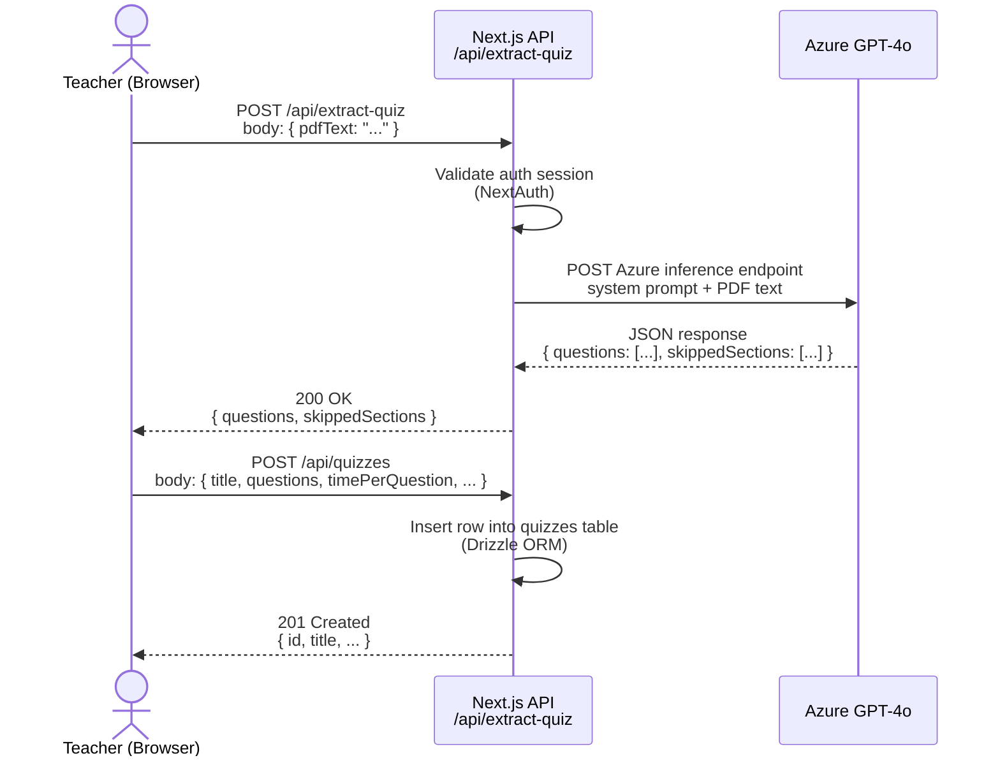
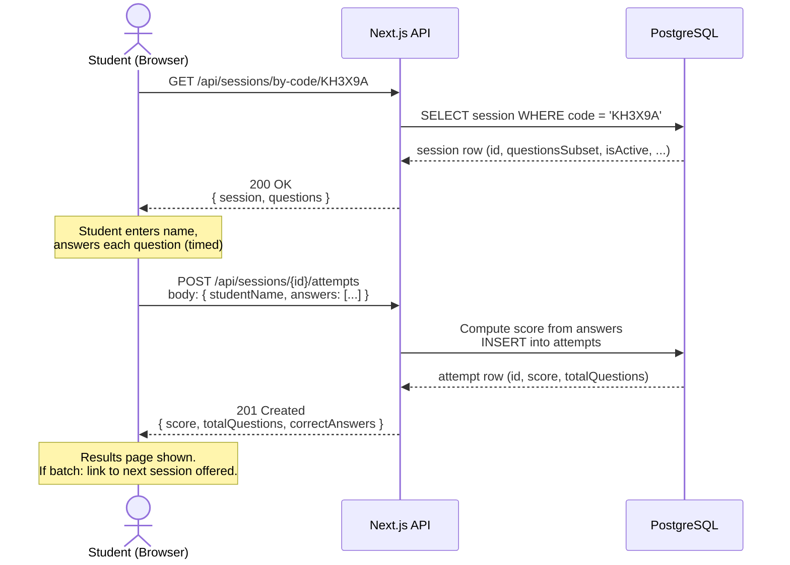

# API Sequence Diagrams — fce-quiz

## 1. PDF Extraction Flow

Teacher uploads a PDF; the server sends extracted text to Azure GPT-4o and returns structured MCQ questions.

## 2. Student Game Flow

Student joins a room by code, answers questions, and submits the attempt.

## Endpoint Reference

| Endpoint | Method | Auth | Description |
|---|---|---|---|
| `/api/extract-quiz` | POST | Teacher | Upload PDF text → GPT-4o → MCQ JSON |
| `/api/quizzes` | POST | Teacher | Save quiz to database |
| `/api/sessions` | POST | Teacher | Create a single room; returns 6-char code |
| `/api/sessions/batch` | POST | Teacher | Create N batch sessions from one quiz |
| `/api/sessions/batch/[batchId]` | GET | Teacher | Get all sessions in a batch |
| `/api/sessions/by-code/[code]` | GET | Public | Student fetches session by room code |
| `/api/sessions/[id]/attempts` | GET | Teacher | List all attempts for a session |
| `/api/sessions/[id]/attempts` | POST | Public | Student submits attempt |
