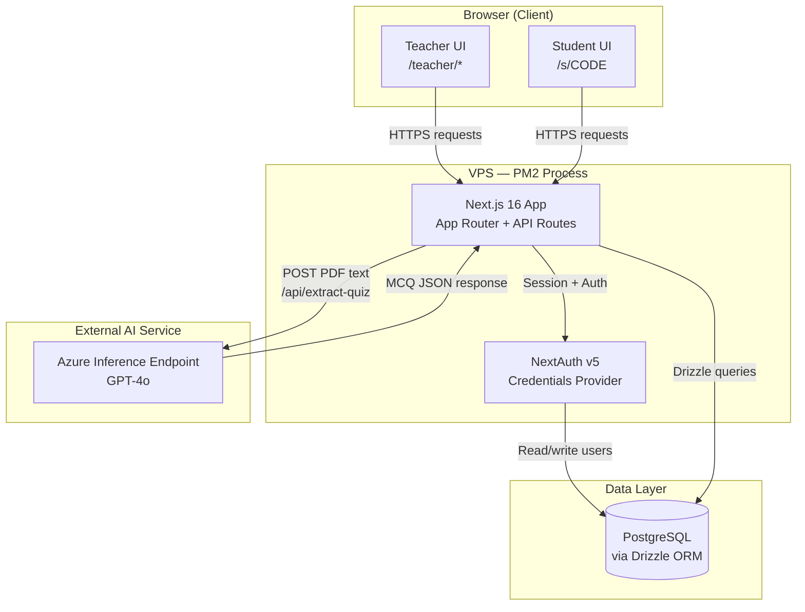
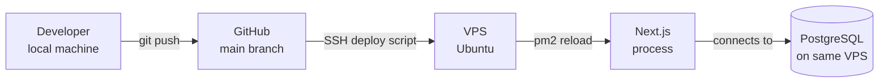

# System Architecture — fce-quiz

## Overview

fce-quiz is a Next.js 16 web application for FCE (Cambridge English) exam practice.
Teachers upload PDF quizzes; students join live sessions via a 6-character room code.

## Architecture Diagram

## Component Descriptions

| Component | Role |
|---|---|
| Next.js App Router | Handles both UI rendering (RSC) and API routes under `/api/*` |
| NextAuth v5 | Email + password authentication; session managed via JWT |
| Drizzle ORM | Type-safe SQL query builder targeting PostgreSQL |
| PostgreSQL | Persistent storage for users, quizzes, sessions, and attempts |
| Azure GPT-4o | Extracts multiple-choice questions from uploaded PDF text |
| PM2 | Process manager on VPS; keeps the Node.js process alive across deploys |

## Deployment

Production runs on a single VPS with PM2 managing the Next.js process.
`pm2 reload` enables zero-downtime restarts on each deploy.
