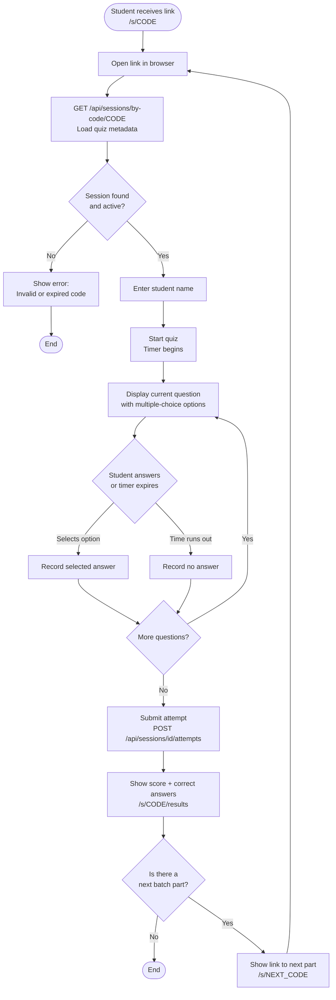

# Student User Flow — fce-quiz

## Flow Diagram

## Step Descriptions

| Step | Details |
|---|---|
| Open link | URL is `/s/CODE` where CODE is the 6-character room code shared by teacher |
| Fetch session | Loads question count, title, and time-per-question; validates the room is active |
| Enter name | Free-text field; stored as `studentName` in the attempt record |
| Answer questions | Each question has a countdown timer; unanswered questions are recorded as blank |
| Submit | Sends all answers in one POST; server computes `score` and persists the attempt |
| See results | Shows score, total questions, and highlights correct/wrong answers |
| Next batch | If the quiz was split into batches, a link to the next part is offered automatically |
