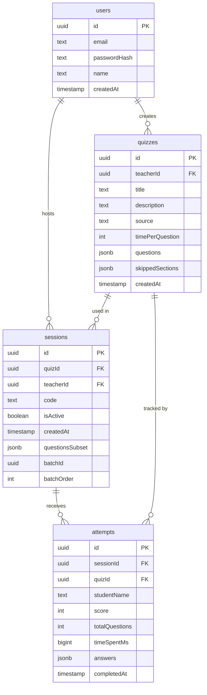

# Database Schema — fce-quiz

## Entity-Relationship Diagram

## Table Notes

### `users`
Stores teacher accounts. Authentication is email + bcrypt-hashed password via NextAuth credentials provider.

### `quizzes`
Stores the full question bank extracted from a PDF. `questions` (jsonb) holds an array of MCQ objects. `skippedSections` (jsonb) records which PDF sections were ignored during extraction. `timePerQuestion` sets the countdown timer (seconds) for each question in a session.

### `sessions`
A session is a live room that students join. `code` is a human-readable 6-character string (e.g. `KH3X9A`). `questionsSubset` (jsonb) holds the slice of quiz questions assigned to this room — useful for batch mode. `batchId` and `batchOrder` group sessions created together as a batch.

### `attempts`
One row per student submission. `answers` (jsonb) records the student's selected option for each question. `score` and `totalQuestions` enable fast leaderboard queries without re-computing from `answers`.
