# FCEQuiz — Master Specification

**Last updated:** 2026-07-04  
**Status:** Living document — update alongside every code change

---

## Table of Contents

1. [System Architecture](#1-system-architecture)
2. [Database Schema](#2-database-schema)
3. [Teacher Authentication](#3-teacher-authentication)
4. [Teacher Dashboard](#4-teacher-dashboard)
5. [PDF Upload & Quiz Creation](#5-pdf-upload--quiz-creation)
6. [Student Quiz Player](#6-student-quiz-player)
7. [Student Auth & Profile](#7-student-auth--profile)
8. [Middleware & Route Protection](#8-middleware--route-protection)
9. [§11 — /join page, Lobby & Podium](#11----join-page-lobby--podium)

---

## 1. System Architecture

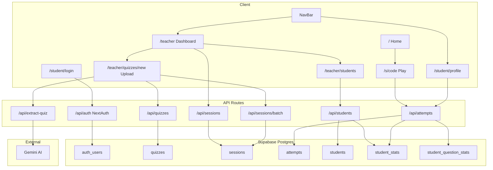

---

## 2. Database Schema

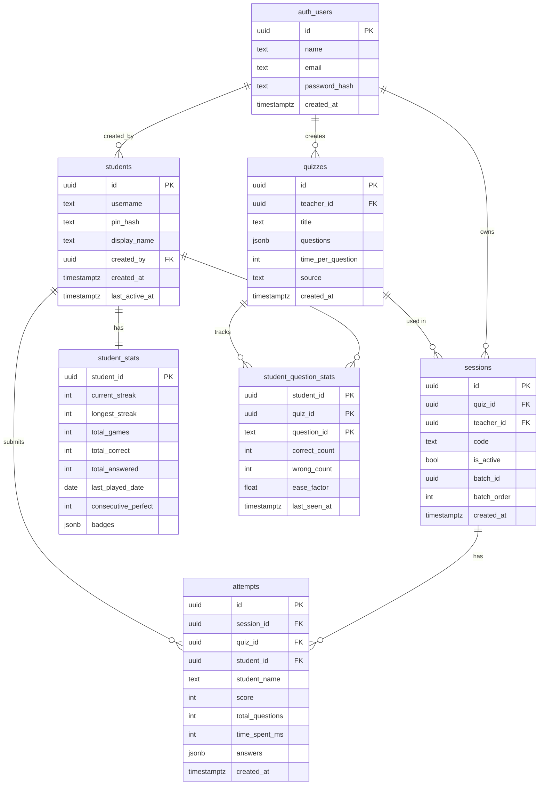

### SQL — New tables (migration)

```sql
CREATE TABLE students (
  id             UUID PRIMARY KEY DEFAULT gen_random_uuid(),
  username       TEXT UNIQUE NOT NULL,   -- 3–20 chars, lowercase, no spaces
  pin_hash       TEXT NOT NULL,           -- bcrypt of 6-digit PIN
  display_name   TEXT NOT NULL,
  created_by     UUID REFERENCES auth_users(id),  -- NULL = self-registered
  created_at     TIMESTAMPTZ DEFAULT now(),
  last_active_at TIMESTAMPTZ
);

CREATE TABLE student_stats (
  student_id          UUID PRIMARY KEY REFERENCES students(id) ON DELETE CASCADE,
  current_streak      INT DEFAULT 0,
  longest_streak      INT DEFAULT 0,
  total_games         INT DEFAULT 0,
  total_correct       INT DEFAULT 0,
  total_answered      INT DEFAULT 0,
  last_played_date    DATE,
  consecutive_perfect INT DEFAULT 0,
  badges              JSONB DEFAULT '[]'
);

CREATE TABLE student_question_stats (
  student_id    UUID REFERENCES students(id) ON DELETE CASCADE,
  quiz_id       UUID REFERENCES quizzes(id) ON DELETE CASCADE,
  question_id   TEXT NOT NULL,
  correct_count INT DEFAULT 0,
  wrong_count   INT DEFAULT 0,
  ease_factor   FLOAT DEFAULT 0.5,
  last_seen_at  TIMESTAMPTZ,
  PRIMARY KEY (student_id, quiz_id, question_id)
);

ALTER TABLE attempts ADD COLUMN student_id UUID REFERENCES students(id);
```

---

## 3. Teacher Authentication

### Requirements

1. Login at `/teacher/login` with email + password → redirect to `/teacher`.
2. Wrong credentials → "Invalid email or password." (no redirect).
3. Register at `/teacher/register` with name, email, password (min 8 chars) → redirect to `/teacher/login`.
4. Password < 8 chars → "Invalid data."
5. Duplicate email → "Email already in use."
6. Sign out → session cleared → redirect to `/teacher/login`.

### Flow

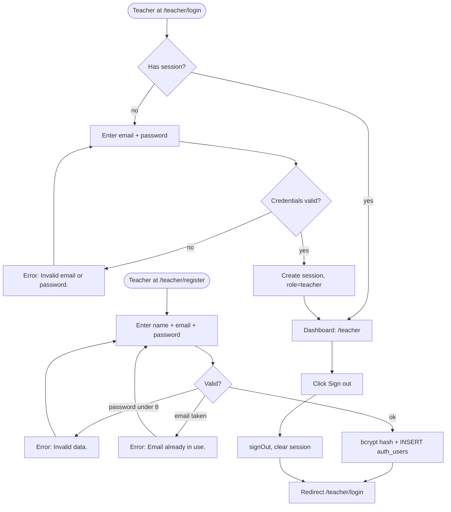

### API

| Endpoint | Method | Body | Returns |
|----------|--------|------|---------|
| `/api/auth/register` | POST | `{ name, email, password }` | 201 `{ ok: true }` / 400 / 409 |
| `/api/auth/callback/credentials` | POST | NextAuth built-in | session JWT |

### Files

| File | Purpose |
|------|---------|
| `web/src/app/teacher/login/page.tsx` | Login form |
| `web/src/app/teacher/register/page.tsx` | Registration form |
| `web/src/app/api/auth/register/route.ts` | Register API |
| `web/src/auth.ts` | NextAuth config — credentials provider |

---

## 4. Teacher Dashboard

### Requirements

1. Quiz list: title, question count, time/q, source.
2. "+ Upload new" → `/teacher/quizzes/new`.
3. "[Edit]" → `/teacher/quizzes/[id]`.
4. "+ Room" → `POST /api/sessions` → banner with room code.
5. Banner has "Copy link" button.
6. Active Rooms: lists all teacher's sessions with code + quiz title.
7. "View results" → `/teacher/sessions/[id]`.
8. Batch sessions show "Part X/Y" badge.
9. "+ Batch" → `POST /api/sessions/batch` → batch notification banner.
10. Unauthenticated `/teacher` → redirect to `/teacher/login`.

### Flow

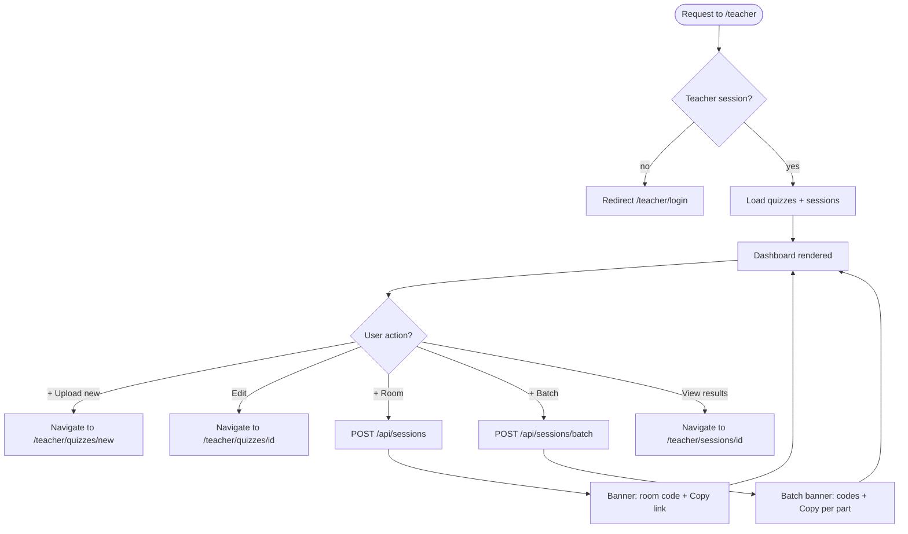

### Batch badge logic

```
isBatch = session.batchId !== null
totalInBatch = sessions.filter(x => x.batchId === session.batchId).length
badge = isBatch ? `Part ${session.batchOrder}/${totalInBatch}` : none
```

### Files

| File | Purpose |
|------|---------|
| `web/src/app/teacher/page.tsx` | Dashboard page |
| `web/src/app/api/quizzes/route.ts` | GET teacher's quizzes |
| `web/src/app/api/sessions/route.ts` | GET/POST sessions |
| `web/src/app/api/sessions/batch/route.ts` | POST batch sessions |

---

## 5. PDF Upload & Quiz Creation

This covers three overlapping features: upload page consolidation, save-and-batch, and auto-batch on PDF import.

### Requirements

**Upload page:**
1. `/teacher/quizzes/new` is the only upload page (public `/upload` and `/import` pages deleted).
2. Drop zone accepts PDF only (`accept=".pdf,application/pdf"`). Non-PDF → "Only PDF files accepted."
3. Drop zone hint: "Drag PDF here, or click to select".

**Extraction & preview:**
4. After extraction, auto-compute `targetGames = Math.ceil(totalQuestions / 15)`.
5. Questions displayed grouped by game (collapsed by default).
6. Teacher can change `targetGames` → groups re-render instantly (client-side).

**Inline question editor:**
7. Expanding a game chunk reveals question cards in read mode.
8. `[✎]` button on each card enters edit mode for that question.
9. Edit mode: textarea for question text, text inputs for options, radio to select correct answer, textarea for explanation.
10. `[✓ Done]` exits edit mode; changes persist in React state.
11. All edits are in-memory; they are saved to DB only when "Save & Create Batch" is clicked.

**Save & batch:**
12. "Save & Create N Batch" saves quiz to DB then creates N sessions.
13. Results shown inline: each part's code + question count.

### Flow

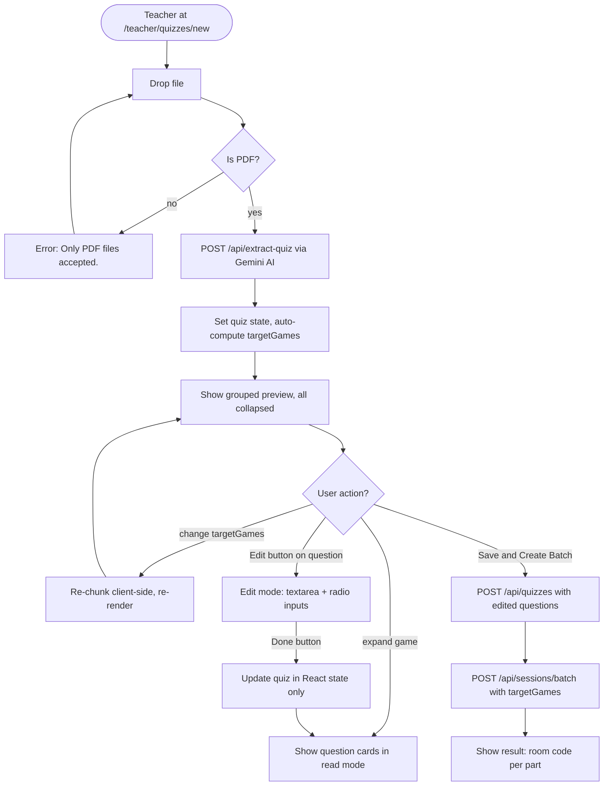

### Split formula

**targetGames mode (used here):**
```
base      = floor(total / targetGames)
remainder = total % targetGames
→ first `remainder` games get (base+1) questions, rest get base

Example: 50q, targetGames=4 → 13, 13, 12, 12
```

**batchSize mode (existing dashboard "+ Batch"):** unchanged.

### Auto-init on extraction

```typescript
setTargetGames(Math.max(1, Math.ceil(data.questions.length / 15)));
setExpandedGames(new Set());   // all collapsed
setEditingIds(new Set());      // no question in edit mode
```

### Inline editor state

```typescript
const [editingIds, setEditingIds] = useState<Set<string>>(new Set());

function updateQuestion(id: string, patch: Partial<MultipleChoiceQuestion>) {
  setQuiz(prev => ({
    ...prev!,
    questions: prev!.questions.map(q => q.id === id ? { ...q, ...patch } : q),
  }));
}

function toggleEdit(id: string) {
  setEditingIds(prev => {
    const next = new Set(prev);
    next.has(id) ? next.delete(id) : next.add(id);
    return next;
  });
}
```

### API

| Endpoint | Method | Body | Returns |
|----------|--------|------|---------|
| `/api/extract-quiz` | POST | `FormData { file: PDF }` | `{ title, questions[] }` |
| `/api/quizzes` | POST | `{ title, questions, time_per_question }` | `{ id }` |
| `/api/sessions/batch` | POST | `{ quizId, targetGames?, batchSize? }` | `BatchResult` |

`targetGames` takes priority over `batchSize`. Both are optional; default `batchSize=15`.

### Files

| File | Purpose |
|------|---------|
| `web/src/app/teacher/quizzes/new/page.tsx` | PDF drop, extraction, preview, inline editor, save&batch |
| `web/src/app/api/extract-quiz/route.ts` | PDF extraction via Gemini |
| `web/src/app/api/quizzes/route.ts` | Save quiz to DB |
| `web/src/app/api/sessions/batch/route.ts` | Create batch sessions |
| `web/src/lib/chunk-by-target-games.ts` | Split logic (client-side preview + server-side) |

**Deleted files:**
- `web/src/app/upload/page.tsx`
- `web/src/app/import/page.tsx`

---

## 6. Student Quiz Player

### Requirements

1. `/s/[code]` shows room code, quiz title, question count, name input; "Join →" requires non-empty name.
2. 3-second countdown (3→2→1) before first question.
3. Each question: text, 4 colored tiles, timer bar (green→yellow→red), progress indicator.
4. Selecting an answer → immediate feedback: correct tile outlined, wrong dimmed, "Correct!" or "Wrong — Answer: X".
5. Timer auto-submits at 0 → "Time's up! Answer: X".
6. Finish screen: score % + "View results →".
7. Invalid/inactive code → "Room not found or closed." + link home.

### Flow

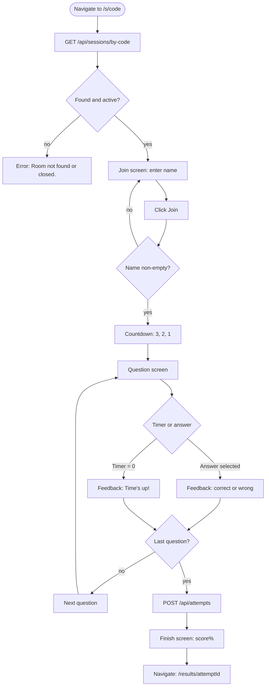

### Score formula

```
score% = Math.round((correctCount / totalQuestions) * 100)
```

### Tile colors (round-robin by index)

| Index | Color |
|-------|-------|
| 0 | Olive-green `#8db600` |
| 1 | Purple `#8a4fd0` |
| 2 | Orange `#e86020` |
| 3 | Teal `#00c9a7` |

### Linked attempt (students)

When a logged-in student plays, `POST /api/attempts` includes `student_id` from the session JWT. Anonymous play leaves `student_id = NULL`.

### Files

| File | Purpose |
|------|---------|
| `web/src/app/s/[code]/page.tsx` | Student quiz player |
| `web/src/app/api/sessions/by-code/[code]/route.ts` | Session lookup |
| `web/src/app/api/attempts/route.ts` | Submit attempt (links student_id if logged in) |

---

## 7. Student Auth & Profile

**Sub-project 1 of 4.** Sub-2 (real-time monitoring), Sub-3 (adaptive retry), Sub-4 (achievements leaderboard) are out of scope.

### Requirements

**Registration & Login:**
1. Students can self-register at `/student/register`: display_name + chosen username + 6-digit PIN.
2. Students can log in at `/student/login` with username + PIN.
3. Teachers can create accounts at `/teacher/students`: only `display_name` required; username + PIN auto-generated.
4. Teacher can reset a student's PIN (shows new PIN once, then hidden).
5. Teacher can delete a student (cascades all data).

**Profile:**
6. `/student/profile` shows stats, badges, and last 20 quiz attempts.
7. Streak increments if last played was yesterday; resets if gap ≥ 2 days; no change if already played today.
8. Badges awarded server-side after each attempt (no duplicates).

### Flow — Student registration & login

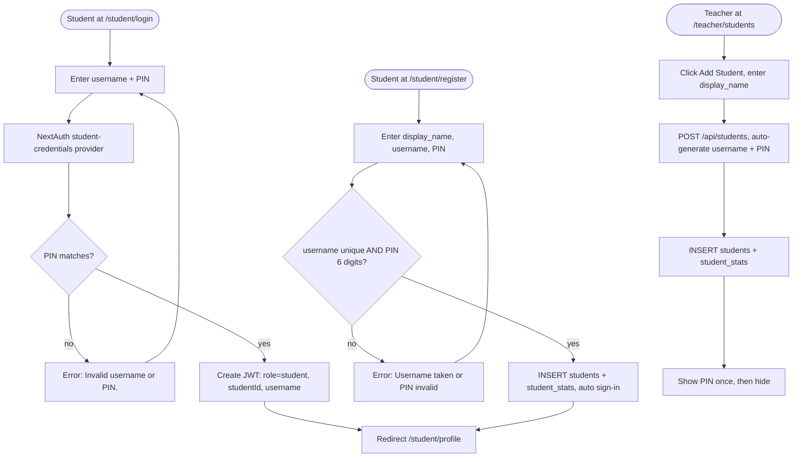

### Flow — Attempt → stats update

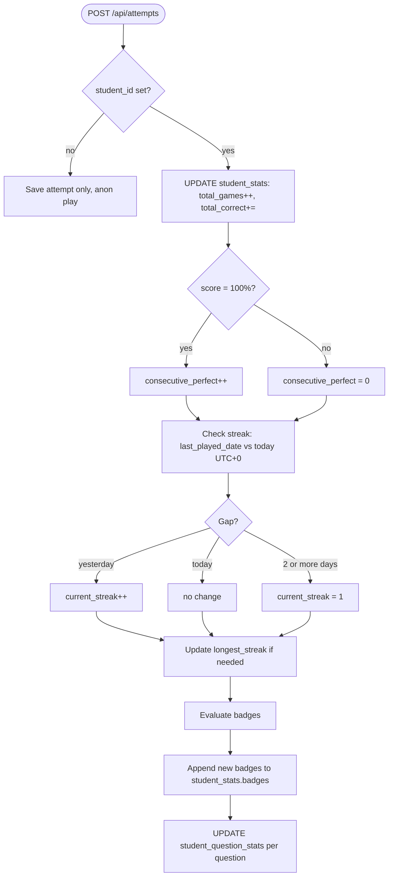

### Badges

| ID | Badge | Condition |
|----|-------|-----------|
| `first_play` | 🎮 First Play | First attempt submitted |
| `first_win` | 🏆 First Win | First 100% score |
| `on_fire` | 🔥 On Fire | 7-day streak |
| `speed_demon` | ⚡ Speed Demon | Correct answer in < 5 seconds |
| `sharpshooter` | 🎯 Sharpshooter | 5 perfect scores in a row |
| `dedicated` | 📚 Dedicated | 30 total games played |

### Authentication config

```typescript
// src/auth.ts — session shape
session.user.role: 'teacher' | 'student'
session.user.studentId?: string   // present only when role === 'student'
session.user.username?: string
```

### Teacher student management API

| Method | Endpoint | Body | Returns |
|--------|----------|------|---------|
| `GET` | `/api/students` | — | Student[] for this teacher |
| `POST` | `/api/students` | `{ display_name }` | `{ username, pin }` (plaintext once) |
| `DELETE` | `/api/students/[id]` | — | 204 |
| `POST` | `/api/students/[id]/reset-pin` | — | `{ pin }` (plaintext once) |

### Username generation

```
base = display_name.toLowerCase().replace(/\s+/g, '_').replace(/[^a-z0-9_]/g, '')
username = base         (if unique)
         = base_2 / base_3 ...  (on collision)
```

### Files

| File | Purpose |
|------|---------|
| `web/src/auth.ts` | Add student-credentials provider; extend JWT/session types |
| `web/src/middleware.ts` | Protect `/student/*` routes |
| `web/src/types/quiz.ts` | Add `Student`, `StudentStats`, `Badge` types |
| `web/src/app/student/login/page.tsx` | Username + PIN login form |
| `web/src/app/student/register/page.tsx` | Self-registration form |
| `web/src/app/student/profile/page.tsx` | Profile: stats, badges, history |
| `web/src/app/teacher/students/page.tsx` | Class roster management |
| `web/src/app/api/students/route.ts` | GET list, POST create |
| `web/src/app/api/students/[id]/route.ts` | DELETE student |
| `web/src/app/api/students/[id]/reset-pin/route.ts` | POST reset PIN |
| `web/src/app/api/student/register/route.ts` | Self-registration |
| `web/src/app/api/attempts/route.ts` | Link student_id; update stats + badges |
| `web/src/lib/badges.ts` | Badge evaluation logic |
| `web/src/lib/streak.ts` | Streak update logic |
| `web/src/components/NavBar.tsx` | Student profile link when role=student |
| `web/db/schema.ts` | Add students/stats tables; add student_id to attempts |
| `web/db/migrations/NNNN_student_auth.sql` | SQL migration |

---

## 8. Middleware & Route Protection

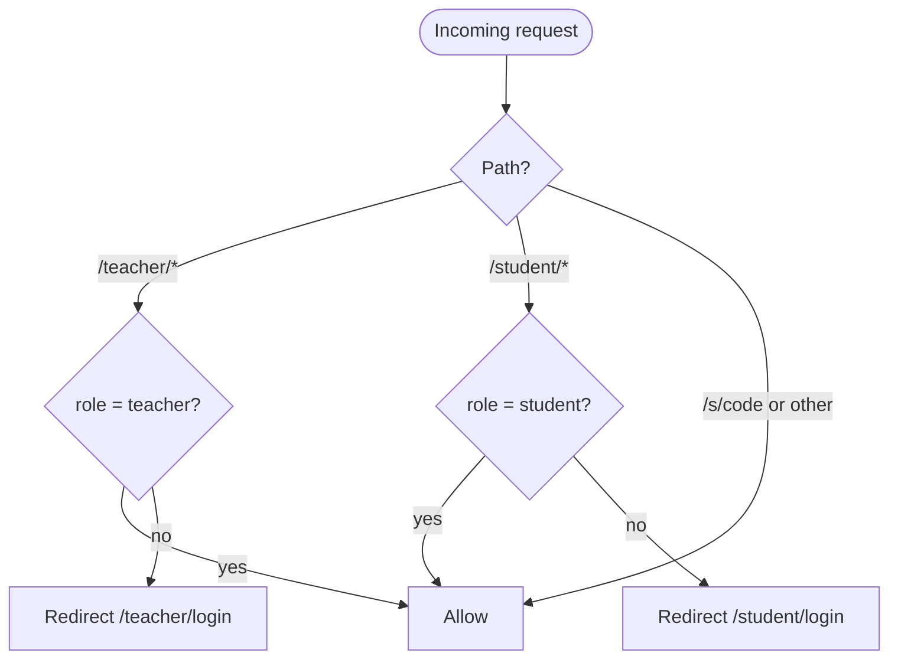

| Route pattern | Required role | Fallback |
|---------------|---------------|----------|
| `/teacher/*` | `teacher` | Redirect `/teacher/login` |
| `/student/*` | `student` | Redirect `/student/login` |
| `/s/[code]` | none (public) | — |
| `/api/quizzes`, `/api/sessions`, `/api/students` | `teacher` | 401 |
| `/api/attempts` | none | — (student_id from JWT if present) |

---

## E2E Test Coverage

| Scenario | Spec section |
|----------|-------------|
| Teacher login / register / sign out | §3 |
| Dashboard quiz list, "+ Room", "+ Batch", "View results" | §4 |
| PDF upload → extraction → preview → save & batch | §5 |
| Inline question edit (read/edit toggle) | §5 |
| Student join → countdown → play → feedback → finish | §6 |
| Invalid room code error | §6 |
| Student self-register → login → play → profile stats | §7 |
| Teacher creates student → student logs in with PIN | §7 |
| Teacher resets PIN → student logs in with new PIN | §7 |
| Streak increments day-over-day (page.clock) | §7 |
| Badge awarded: first_play, first_win | §7 |
| Teacher opens live leaderboard during session | §8 |
| Student answers question → rank updates in live view | §8 |
| Student plays practice session → due count updates | §9 |
| Student views leaderboard, sees top 10 ranked | §10 |

---

## §8 — Real-time Teacher Monitoring

**Date:** 2026-07-02 | **Status:** Done | **Depends on:** §5

### Overview

Teacher opens a live leaderboard view at `/teacher/sessions/[id]/live` while a quiz session is in progress. Updates in real-time as students answer, showing rank, name, score, and animated position changes.

### Database — `session_progress` table

| Column | Type | Notes |
|--------|------|-------|
| `id` | UUID PK | auto |
| `session_id` | UUID FK → sessions | ON DELETE CASCADE |
| `student_name` | TEXT | identifies student |
| `current_question` | INTEGER | 0-indexed, increments each answer |
| `score` | INTEGER | running correct count |
| `total_questions` | INTEGER | from session |
| `is_finished` | BOOLEAN | true when student submits final answer |
| `updated_at` | TIMESTAMPTZ | for diff detection |

Unique constraint: `(session_id, student_name)`

### API

**`POST /api/sessions/[id]/progress`** — called by quiz player after each answer (no auth required)
- Body: `{ studentName, questionIndex, isCorrect, totalQuestions }`
- Upsert row; set `is_finished = true` when `questionIndex + 1 === totalQuestions`

**`GET /api/sessions/[id]/live`** — SSE stream (teacher auth required)
- Every 1.5s: query `session_progress` ordered by score DESC
- Sends initial snapshot on connect; closes on client disconnect
- Payload: `{ entries: [{ rank, studentName, score, currentQuestion, totalQuestions, isFinished }], playing, finished }`

### Frontend

- `/teacher/sessions/[id]/live` — dark full-screen leaderboard with rank badges 🥇🥈🥉, progress bar per student, CSS transition animations on rank change, flash on position change
- `/teacher/sessions/[id]` — "▶ Live View" link added to header

### Quiz Player Change

Fire-and-forget `fetch` to progress endpoint after each answer (no await, doesn't block UI).

---

## §9 — Adaptive Solo Retry

**Date:** 2026-07-02 | **Status:** Done | **Depends on:** §5

### Overview

Students practice any quiz solo using spaced repetition (SM-2). The system tracks per-question difficulty and surfaces only "due" questions. Entry point: `/student/practice/[quizId]`, linked from profile.

### Database — changes to `student_question_stats`

Two columns added (migration 0006):

| Column | Type | Notes |
|--------|------|-------|
| `repetitions` | INTEGER DEFAULT 0 | Consecutive correct answers; resets to 0 on wrong |
| `next_review_at` | TIMESTAMPTZ | NULL = never reviewed (always due); set by SM-2 |

### SM-2 Algorithm — `web/src/lib/sm2.ts`

Binary quality scale (correct=4, wrong=1):
- Correct: `interval`: rep=0→1d, rep=1→6d, rep≥2→`round(6 * ef^(rep-1))` days; `newRep = rep + 1`; EF unchanged at q=4
- Wrong: `interval = 1d`; `newRep = 0`; `newEF = max(1.3, ef - 0.54)`

Example intervals (ef=2.5): 1d → 6d → 15d → 37d → 93d

### API

**`GET /api/student/practice/[quizId]`** (student auth)
- Returns due questions (`next_review_at IS NULL OR <= now()`) joined with question data
- If 0 due: returns empty questions + `nextReviewAt` (earliest scheduled)

**`POST /api/student/practice/[quizId]`** (student auth)
- Body: `{ answers: [{ questionId, isCorrect }] }`
- Batch upsert SM-2 values to `student_question_stats`

**`GET /api/student/practice-summary`** (student auth)
- Returns `[{ quizId, quizTitle, dueCount }]` for all quizzes student has attempted

### Frontend

- `/student/practice/[quizId]` — 5 states: loading / nothing-due / ready / playing / finished; untimed; dark theme
- `/student/profile` — "Luyện tập" section with per-quiz due count badges and practice links

---

## §10 — Achievements Leaderboard

**Date:** 2026-07-02 | **Status:** Done | **Depends on:** §5

### Overview

Public leaderboard at `/student/leaderboard` shows top 10 students ranked by total correct answers. No new DB tables — data from existing `student_stats` joined with `students`.

### API

**`GET /api/student/leaderboard`** (student auth)
- JOIN `student_stats` with `students` on `student_id`
- ORDER BY `total_correct DESC` LIMIT 10
- Response: `[{ rank, displayName, totalCorrect, totalGames }]`

### Frontend

- `/student/leaderboard` — dark theme, rank badges 🥇🥈🥉 for top 3, loading/empty states
- `/student/profile` — "Xem bảng xếp hạng →" link added

---

## §11 — /join page, Lobby & Podium

**Date:** 2026-07-04 | **Status:** Planned | **Depends on:** §6, §8

### Overview

Three interlinked features that transform FCEQuiz into a synchronous multiplayer game (Wayground/Quizizz-inspired):

1. **/join page** — students enter a room code on a dedicated landing page.
2. **Lobby** — students wait until teacher starts; teacher sees live join count per room.
3. **Podium** — end screen showing final rankings, triggered automatically or manually.

### Database — `sessions.status` column

Replace the binary `is_active` flag with a three-state enum:

| Status | Meaning |
|--------|---------|
| `waiting` | Room created; students can join lobby; game not started |
| `active` | Teacher started game; students are answering |
| `ended` | Game over; podium is shown |

**Migration SQL:**

```sql
ALTER TABLE sessions ADD COLUMN status text NOT NULL DEFAULT 'waiting';

-- Existing sessions were all already in active play; set them active.
UPDATE sessions SET status = 'active';

-- is_active column kept (not dropped) to avoid breaking existing queries.
-- Treat is_active as deprecated; all new logic reads status.
```

**Drizzle schema addition (`web/src/db/schema.ts`):**

```typescript
status: text('status').notNull().default('waiting'),
// 'waiting' | 'active' | 'ended'
```

### State machine

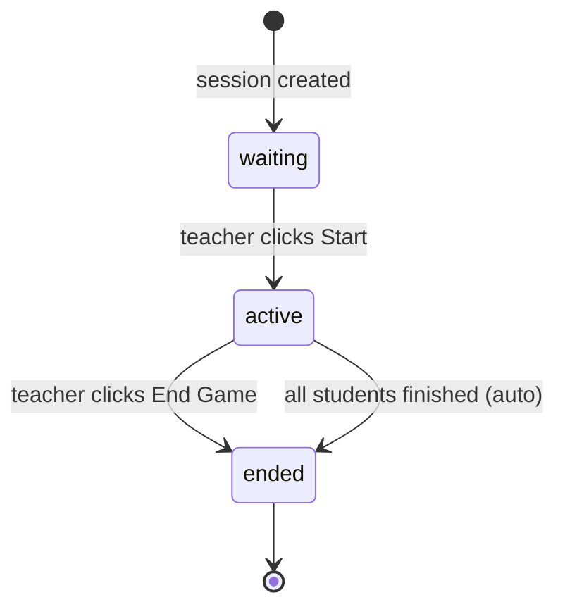

Auto-trigger rule: when the last student submits answers, `POST /api/attempts` checks whether all `session_progress` rows for the session have `is_finished = true`. If so, it sets `sessions.status = 'ended'`. Guard: skip auto-trigger if `session_progress` has 0 rows (nobody joined via lobby).

---

### Feature 1: /join page

**Route:** `/join` (public, no auth)

Simple page with a single code input. On submit it redirects to `/s/[code]` — no backend call needed on this page itself.

```
┌──────────────────────────────┐
│  FCEQuiz                     │
│                              │
│  Enter your room code        │
│  ┌──────────────┐  ┌──────┐  │
│  │  A B C 1 2  │  │ Join │  │
│  └──────────────┘  └──────┘  │
│                              │
└──────────────────────────────┘
```

- Input: auto-uppercase, max 6 chars.
- Submit → `router.push('/s/' + code.trim().toUpperCase())`.
- Empty input → disabled Join button.

**File:** `web/src/app/join/page.tsx` (new, client component)

---

### Feature 2: Lobby

#### Student side — `/s/[code]`

The quiz player adds a `status` check after fetching the session. New behavior:

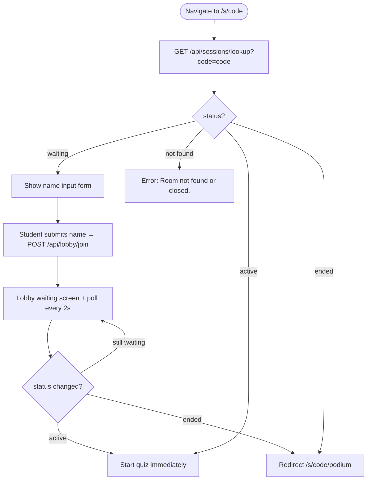

**Lobby waiting screen:**

```
┌──────────────────────────────┐
│  Quiz: FCE Vocabulary        │
│                              │
│  You're in the lobby!        │
│  Hi, Nguyen Van A 👋         │
│                              │
│  Waiting for teacher to      │
│  start the game...           │
│  ● ● ●  (animated)          │
└──────────────────────────────┘
```

**Lobby join:** `POST /api/lobby/join` with `{ code, studentName }`. Server upserts a `session_progress` row with `current_question = 0, score = 0, is_finished = false`. This row serves as a presence signal; the polling endpoint counts these rows.

**Polling endpoint:** `GET /api/sessions/lookup?code=` — existing `by-code` route refactored (or a new lightweight route) that returns `{ id, status, quizTitle, timePerQuestion }`. No auth required. Called every 2 seconds from lobby.

#### Teacher side — `/teacher`

Teacher dashboard polls its existing `/api/sessions` every 3s (new — currently loads once on mount). Response enriched with:

- `lobbyCount`: COUNT of `session_progress` rows for this session (all rows = all who joined).
- `finishedCount`: COUNT where `is_finished = true`.

**Dashboard UI changes:**

| Status | Session row shows |
|--------|------------------|
| `waiting` | `[waiting]` badge · "N in lobby" · **[▶ Start]** button · 🗑 |
| `active` | `[live]` badge · "N/M finished" · **[⏹ End]** button · View results · 🗑 |
| `ended` | `[ended]` badge · View results · 🗑 |

**Start game:** `PATCH /api/sessions/[id]` `{ status: 'active' }` → teacher auth required. Students polling lobby detect `status = 'active'` within ≤2s and start quiz.

**End game (manual):** `PATCH /api/sessions/[id]` `{ status: 'ended' }` → students polling detect `status = 'ended'` and redirect to podium.

---

### Feature 3: Podium

**Route:** `/s/[code]/podium` (public, no auth)

Final results screen shown to students after game ends. Teacher link from dashboard to `/s/[code]/podium` for each ended session.

```
┌──────────────────────────────────────┐
│  🏆  Final Results                   │
│  FCE Vocabulary                      │
│                                      │
│  🥇  Nguyen Van A      18 / 20       │
│  🥈  Tran Thi B        15 / 20       │
│  🥉  Le Van C          14 / 20       │
│  4.  Pham Thi D        12 / 20       │
│  5.  Hoang Van E       10 / 20       │
│                                      │
│  [Play again]        [Home]          │
└──────────────────────────────────────┘
```

- Data source: `GET /api/sessions/[id]/podium` — joins `attempts` for this session, orders by `score DESC, time_spent_ms ASC` (tiebreak: faster wins).
- All students who submitted attempts appear; top 3 get medal icons.
- Students who joined lobby but did not finish (no attempt row) are not shown.
- "Play again" → `/s/[code]` (returns to name input if session is ended — shows error; effectively a no-op; teacher would need to create a new session).

**Auto-redirect:** When `POST /api/attempts` detects all finished and sets `status = 'ended'`, the response includes `{ podiumRedirect: true }`. The quiz finish screen redirects to `/s/[code]/podium` instead of the normal results page.

Students still in lobby when teacher manually ends game: their 2s poll returns `status = 'ended'` → redirect to `/s/[code]/podium` (they have no attempt row so they appear as spectators only).

---

### API summary

| Method | Route | Auth | Purpose |
|--------|-------|------|---------|
| GET | `/api/sessions/lookup?code=` | none | Student poll: returns `{ id, status, quizTitle, timePerQuestion }` |
| POST | `/api/lobby/join` | none | Upsert lobby presence in `session_progress` |
| PATCH | `/api/sessions/[id]` | teacher | Update status: `{ status: 'active' \| 'ended' }` |
| GET | `/api/sessions/[id]/podium` | none | Final rankings from `attempts` |
| GET | `/api/sessions` | teacher | Enriched with `lobbyCount`, `finishedCount`, `status` |

---

### Files

| File | Change |
|------|--------|
| `web/src/db/schema.ts` | Add `status` column to sessions |
| `web/db/migrations/0011_session_status.sql` | Migration SQL |
| `web/src/app/join/page.tsx` | New: /join landing page |
| `web/src/app/s/[code]/page.tsx` | Add lobby state (waiting screen + 2s poll) |
| `web/src/app/s/[code]/podium/page.tsx` | New: podium screen |
| `web/src/app/api/sessions/lookup/route.ts` | New: lightweight status poll (GET ?code=) |
| `web/src/app/api/lobby/join/route.ts` | New: upsert lobby presence |
| `web/src/app/api/sessions/[id]/route.ts` | Add PATCH handler for status update |
| `web/src/app/api/sessions/[id]/podium/route.ts` | New: ranked results from attempts |
| `web/src/app/api/sessions/route.ts` | Enrich list with lobbyCount, finishedCount, status |
| `web/src/app/api/attempts/route.ts` | Auto-trigger status=ended when all finished |
| `web/src/app/teacher/page.tsx` | Show status badges, Start/End buttons, lobby count |

---

### E2E test scenarios

| Scenario | Details |
|----------|---------|
| Student enters code on /join → lands on lobby | Code exists, status=waiting |
| Student waits in lobby, teacher starts → quiz begins | Status poll detects active |
| Multiple students join lobby → teacher sees count | lobbyCount increments |
| Last student finishes → all auto-redirected to podium | Auto-trigger |
| Teacher clicks End Game mid-session → podium shown | Manual trigger |
| Student in lobby when teacher ends → redirect to podium | Poll detects ended |
| Podium shows correct ranking (score DESC, time ASC) | Tiebreak verified |
